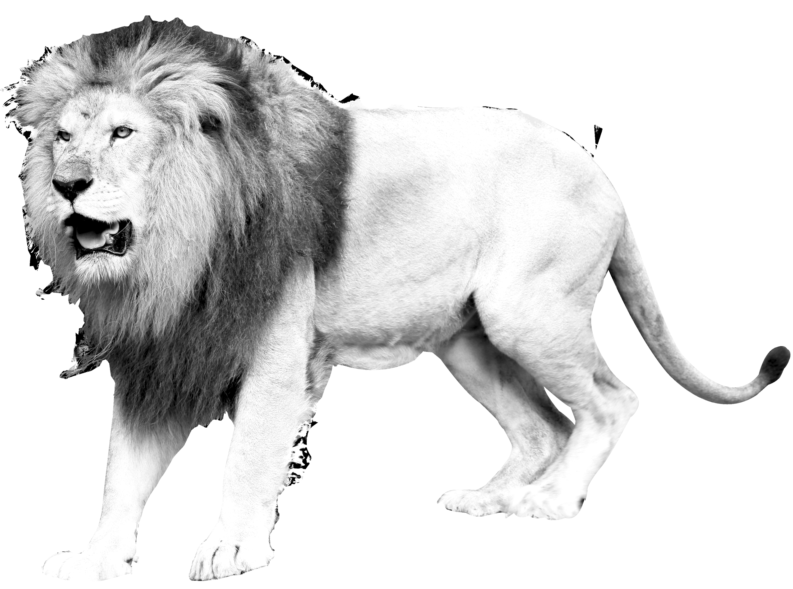
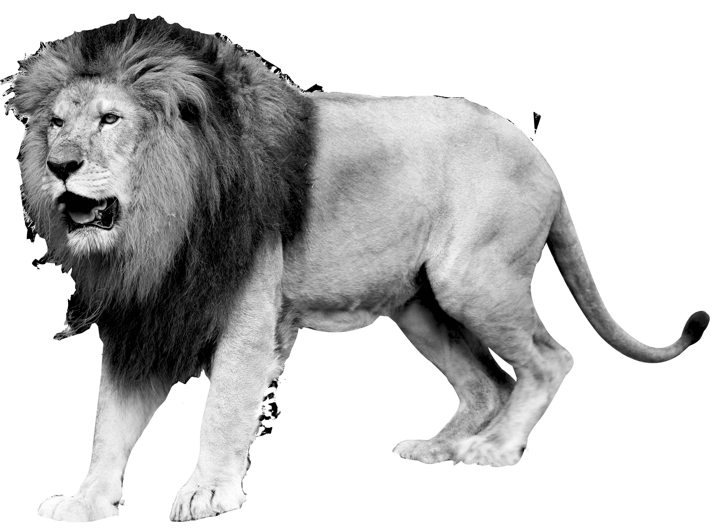

# Лабораторная работа: Цветовые модели и передискретизация изображений

## Описание

В данной лабораторной работе проводятся операции с изображениями, такие как выделение компонент цветов, преобразование в модель HSI, инвертирование яркостной компоненты, а также растяжение и сжатие изображений. 

## 1. Цветовые модели

### 1.1 Выделение компонентов R, G, B

**Исходное изображение**

Из исходного изображения выделены компоненты R, G и B, и сохранены как отдельные изображения.

- **R_channel.png** - Красный канал

- **G_channel.png** - Зеленый канал

- **B_channel.png** - Синий канал

### 1.2 Преобразование в модель HSI и сохранение яркостной компоненты

Из исходного изображения был рассчитан яркостной компонент HSI и сохранен как отдельное изображение.

- **I_component.png** - Яркостная компонента

### 1.3 Инвертирование яркостной компоненты

Инвертированное изображение яркостной компоненты было сохранено отдельно.

- **I_inverted.png** - Инвертированная яркостная компонента

## 2. Передискретизация изображений

### 2.1 Растяжение изображения (интерполяция)

Изображение было растянуто в 2 раза с использованием метода ближайшего соседа.

- **stretched_image.png** - Растянутое изображение

### 2.2 Сжатие изображения (децимация)

Изображение было сжато в 3 раза, уменьшая количество пикселей.

- **compressed_image.png** - Сжатое изображение

### 2.3 Передискретизация изображения в два прохода

Изображение было сначала растянуто в 2 раза, а затем сжато в 2 раза.

- **resampled_image.png** - Изображение после двух проходов (растяжение и сжатие)

### 2.4 Передискретизация за один проход

Изображение было передискретизировано в 2 раза за один проход методом ближайшего соседа.

- **one_step_resampled_image.png** - Передискретизация за один проход

## Заключение

В ходе выполнения лабораторной работы были успешно выполнены все требуемые операции, включая обработку цветовых каналов, преобразование в модель HSI, инвертирование яркости и различные способы передискретизации изображений.
