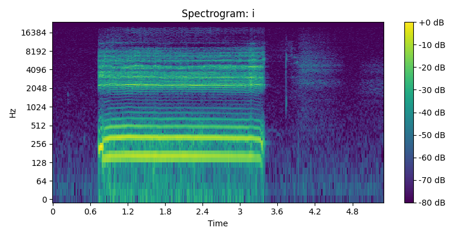
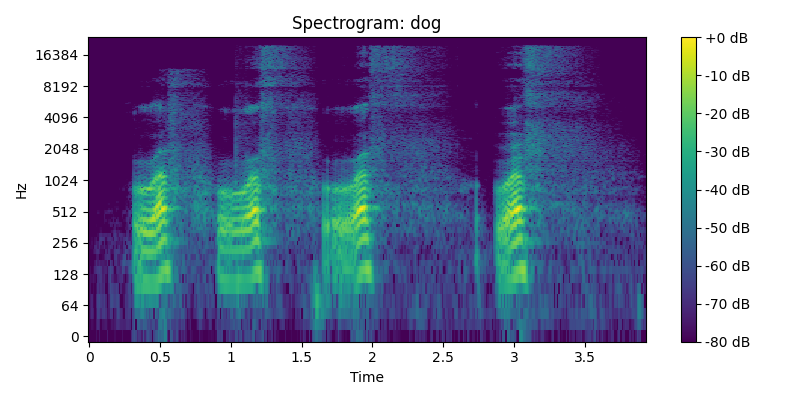
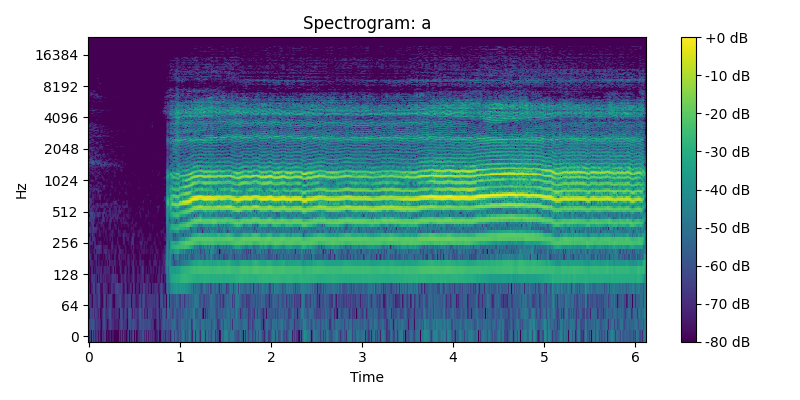

# Лабораторная работа №10. Обработка голоса

Результаты

| Файл | Мин/Макс, Гц  | f₀ (медиана), Гц | № обертонов | Форманты, Гц           |
|------|---------------|------------------|-------------|------------------------|
| i    | 0.0 … 7007.8  | 160.6            | 2           | 2578.2, 4727.4, 7280.1 |
| dog  | 70.3 … 1265.6 | 87.3             | 2           | 613.4, 5497.6, 9011.3  |
| a    | 0.0 … 6000.0  | 137.2            | 1           | 827.6, 4798.5, 13786.2 |

## Спектрограмма И

## Спектрограмма Лай

## Спектрограмма А

## Выводы

Практический диапазон голоса «A» и «И» простирается до ≈6–7 кГц, что согласуется с естественной шириной спектра вокала.

«И» (160 Гц) и «А» (137 Гц) лежат в диапазоне мужского голоса.

Узкий диапазон (70…1265 Гц) подтверждает, что это голос, а не натуральный лай

f₀≈87 Гц — очень низкий тон, характерный для басовой зоны голоса при «рычании»

Два обертона (≈174, 261 Гц) хорошо видны в 200–400 Гц.

Форманты F1≈613 Гц, F2≈5498 Гц, F3≈9011 Гц отражают резонансные «прорывы» в спектре:

* Нижняя форманта ≈613 Гц близка к F1 речевого «О»;
* Высокие форманты — артефакты резонансов речевого тракта при фальцетном рычании.

Отличие «лающего» голоса от реального лая видно по узкой полосе частот и низкому f₀ (≈87 Гц) с гармониками в басу — это чисто голосовая имитация.

Для «А» F1≈828 Гц попадает в классический диапазон 700–1000 Гц;

P.S. Исходники звуков удалены :)
