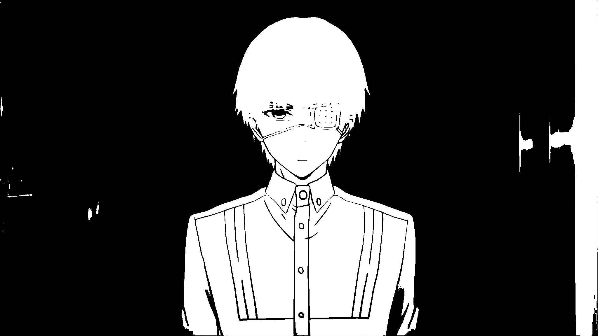
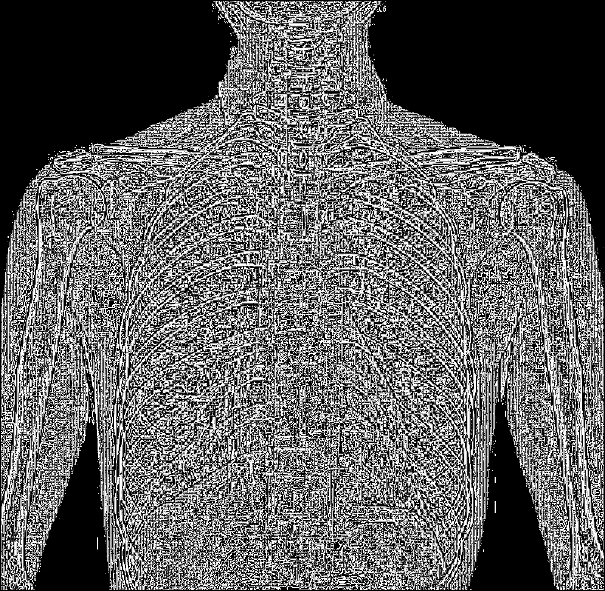

# Лабораторная работа: Обесцвечивание и бинаризация растровых изображений

## Описание

В данной лабораторной работе выполняется преобразование изображений в полутоновые и бинарные изображения с использованием различных методов бинаризации. Для выполнения задания использовались изображения из папки `pictures_scr`, а результаты обработки были сохранены в папку `pictures_results`.

## Примененные методы

1. **Приведение к полутоновому изображению**  
   Для каждого изображения был вычислен яркостный канал, который использовался для преобразования в полутоновое изображение.

2. **Бинаризация с использованием порога**  
   Для каждого полутонового изображения был применен автоматический выбор порога методом Оцу, который вычисляет оптимальный порог для разделения изображения на черный и белый цвета.

3. **Адаптивная бинаризация Сингха (окно 5x5)**  
   Для изображений с неравномерным освещением или сложными фонами была использована адаптивная бинаризация, где порог для каждого пикселя вычисляется на основе его окружения (окно 5x5).

## Результаты

### Пример 1: Изображение дома 

#### Исходное изображение:

#### Полутоновое изображение:

#### Бинаризация:

#### Адаптивная бинаризация Сингха (Окно 5x5):

### Пример 2: Изображение карты 

#### Исходное изображение:

#### Полутоновое изображение:

#### Бинаризация:

#### Адаптивная бинаризация Сингха (Окно 5x5):

### Пример 3: Изображение Аниме

#### Исходное изображение:

#### Полутоновое изображение:

#### Бинаризация:

#### Адаптивная бинаризация Сингха (Окно 5x5):

### Пример 4: Портрет 

#### Исходное изображение:

#### Полутоновое изображение:

#### Бинаризация:

#### Адаптивная бинаризация Сингха (Окно 5x5):

### Пример 5: Изображение Рентгена

#### Исходное изображение:

#### Полутоновое изображение:

#### Бинаризация:

#### Адаптивная бинаризация Сингха (Окно 5x5):

### Пример 6: Изображение Текста

#### Исходное изображение:

#### Полутоновое изображение:

#### Бинаризация:

#### Адаптивная бинаризация Сингха (Окно 5x5):

## Выводы по адаптивной бинаризации Сингха

### Плюсы:
- **Гибкость**: Адаптивная бинаризация позволяет обрабатывать изображения с неравномерным освещением. В отличие от стандартной бинаризации, где применяется один порог ко всему изображению, адаптивная бинаризация вычисляет порог для каждого пикселя на основе его окружения.
- **Подходит для сложных изображений**: Этот метод хорошо работает с изображениями, где объекты имеют различные уровни освещенности, например, фотографии с тенью или изображениями с частично затененными областями.

### Минусы:
- **Более медленная обработка**: Адаптивная бинаризация требует вычисления порога для каждого пикселя, что может занять больше времени по сравнению с простым пороговым методом.
- **Не всегда дает оптимальный результат на простых изображениях**: Если изображение имеет равномерное освещение или контраст, использование адаптивной бинаризации может привести к излишнему усложнению и плохим результатам.

## Заключение

Адаптивная бинаризация Сингха является мощным инструментом для работы с изображениями с различным освещением и текстурами. Этот метод позволяет точно выделять объекты, даже если они плохо видны на фоне. Однако для изображений с хорошим контрастом между объектами и фоном проще использовать стандартную бинаризацию.
