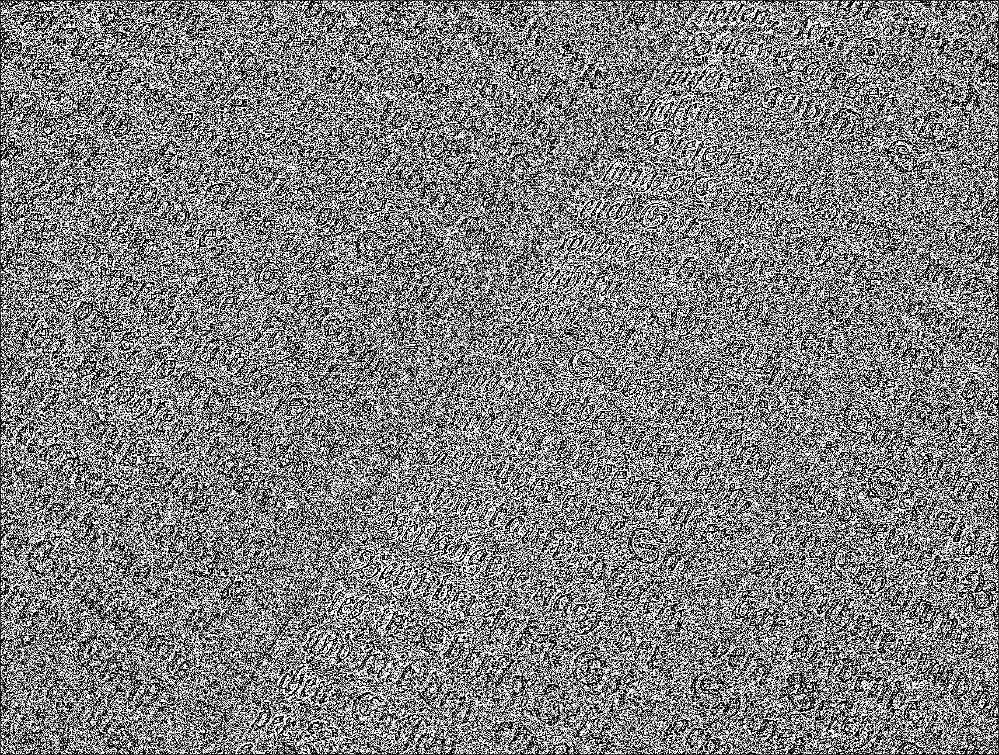
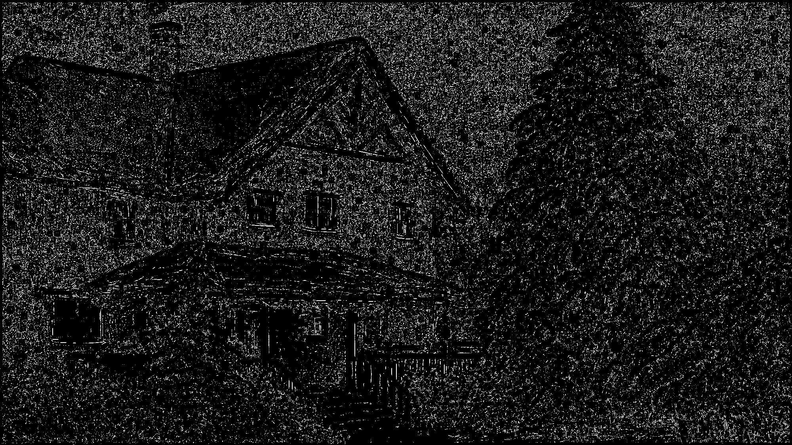

# Лабораторная работа №3: Фильтрация изображений и морфологические операции

## Задание

В данной лабораторной работе была выполнена фильтрация монохромных (полутоновых) изображений с использованием морфологического открытия и кольцевого структурирующего элемента с окном 3x3. В качестве исходных данных использовались монохромные изображения, на которых были применены морфологические операции, а также было создано разностное изображение с использованием операции XOR или модуля разности.

### Структурирующий элемент
- Структурирующий элемент: кольцо 3x3.
- Метод фильтрации: морфологическое открытие.

### Методы обработки изображений:
1. Применение морфологического открытия для удаления шума.
2. Создание разностного изображения (модуль разности или XOR).
3. Применение пороговой фильтрации для уменьшения шума в разностном изображении.
4. Дополнительное размытие изображения для улучшения качества.

## Исходные изображения

### Пример 1

#### Исходное изображение

#### После применения фильтрации (морфологическое открытие)

#### Разностное изображение (после фильтрации)

### Бинаризация

### Пример 2

#### Исходное изображение

#### После применения фильтрации (морфологическое открытие)

#### Разностное изображение (после фильтрации)

### Бинаризация

### Пример 3

#### Исходное изображение

#### После применения фильтрации (морфологическое открытие)

#### Разностное изображение (после фильтрации)

### Бинаризация

### Пример 4

#### Исходное изображение

#### После применения фильтрации (морфологическое открытие)

#### Разностное изображение (после фильтрации)

### Бинаризация

## Выводы

1. **Фильтрация (морфологическое открытие)** эффективно устраняет мелкие шумы на изображении, сохраняя основные структуры и формы.
2. **Разностное изображение** демонстрирует значительные различия между исходным изображением и изображением после морфологического открытия. После применения пороговой фильтрации и гауссова размытия результат значительно улучшается, и шумы становятся менее выраженными.
3. Применение **пороговой фильтрации** позволяет значительно уменьшить мелкие шумовые точки, оставив только существенные различия.
4. **Гауссово размытие** помогает смягчить остаточные артефакты и улучшить визуальное восприятие разностного изображения.
