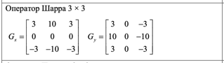
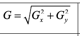

# Лабораторная работа №4. 

## Выделение контуров на изображении

Выполняется одно задание на выбор. В качестве входных данных берётся цветное или полутоновое изображение. Цветное изображение сводится к полутоновому.

Демонстрируется:
1) Исходное цветное изображение.
2) Полутоновое изображение.
3) Три градиентные матрицы Gx, Gy, G, нормализованные так, что значения
яркости лежат от 0 до 255.
4) Бинаризованная градиентная матрица G, где порог подбирается опытным
путём.

ВАРИАНТ 21:

Оператор:

Формула Градиента:

