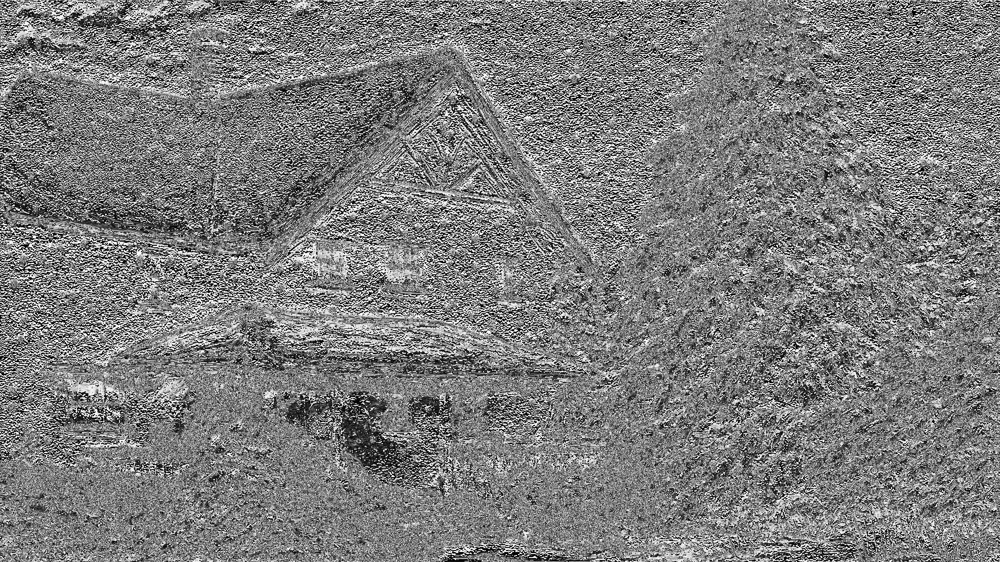
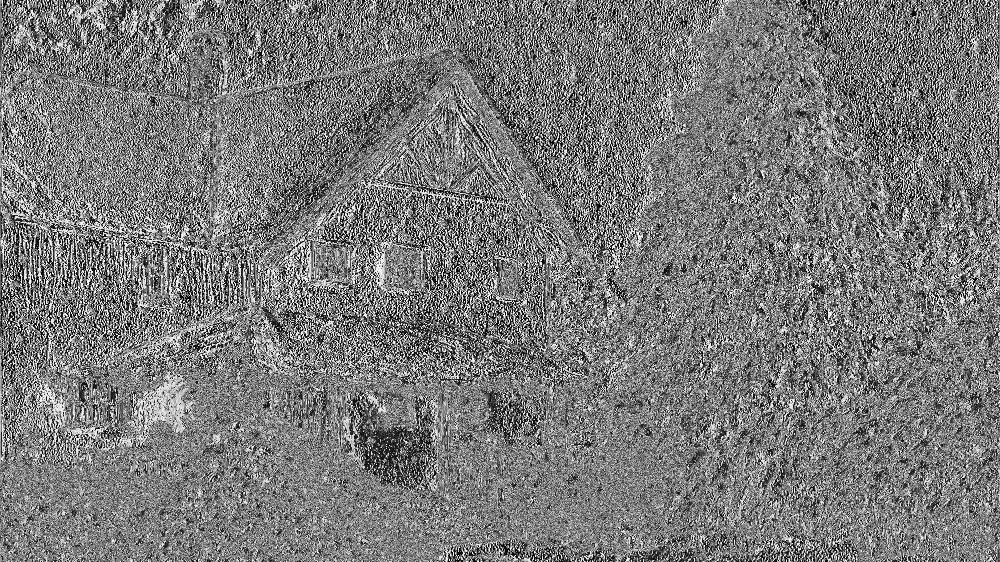
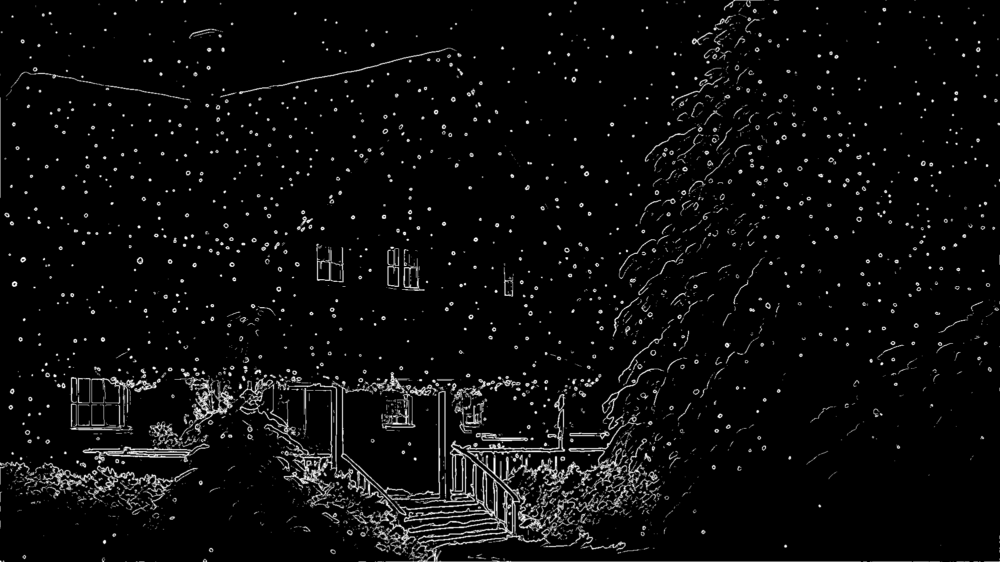
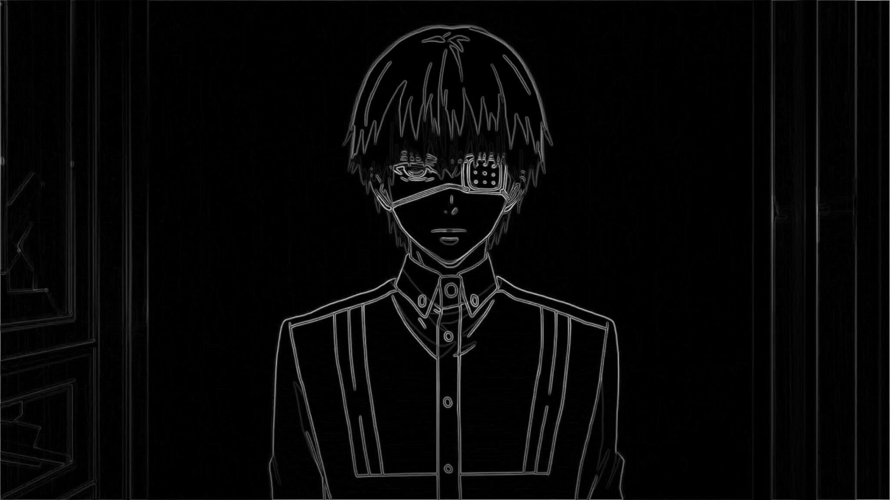
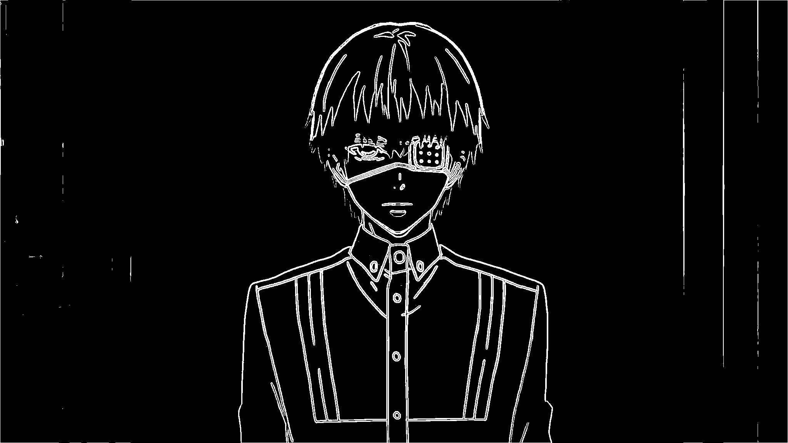
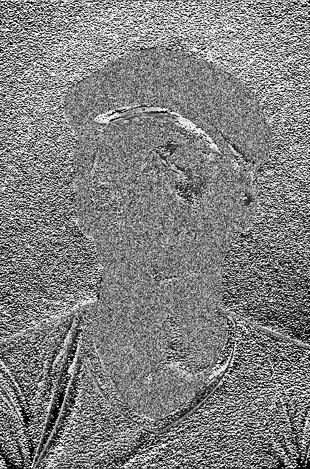
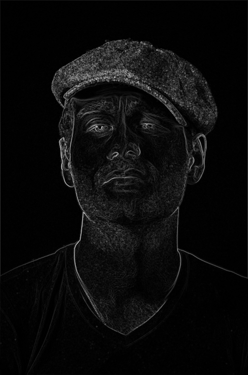
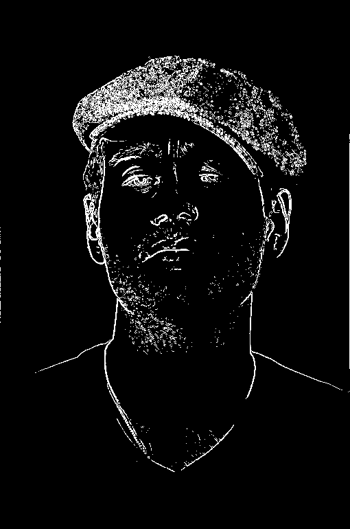

# Лабораторная работа №4: Выделение контуров на изображении

## Задание

В данной лабораторной работе требуется выполнить выделение контуров на изображении с использованием оператора Шарра 3x3. Для этого будут использованы изображения из папки `pictures_src`. Результаты обработки будут сохранены в папку `pictures_results`.

Задание состоит из следующих шагов:
1. Исходное цветное изображение.
2. Полутоновое изображение.
3. Три градиентные матрицы Gx, Gy, G, нормализованные так, чтобы значения яркости лежат от 0 до 255.
4. Бинаризованная градиентная матрица G, где порог подбирается опытным путём.

## Исходное изображение и результаты

### Пример 1:

**Исходное изображение:**

**Результаты:**

- **Полутоновое изображение:**

- **Градиент по оси X:**

- **Градиент по оси Y:**

- **Нормализованный градиент:**

- **Бинаризованный градиент:**

### Пример 2:

**Исходное изображение:**

**Результаты:**

- **Полутоновое изображение:**

- **Градиент по оси X:**

- **Градиент по оси Y:**

- **Нормализованный градиент:**

- **Бинаризованный градиент:**

### Пример 1:

**Исходное изображение:**

**Результаты:**

- **Полутоновое изображение:**

- **Градиент по оси X:**

- **Градиент по оси Y:**

- **Нормализованный градиент:**

- **Бинаризованный градиент:**

### Пример 1:

**Исходное изображение:**

**Результаты:**

- **Полутоновое изображение:**

- **Градиент по оси X:**

- **Градиент по оси Y:**

- **Нормализованный градиент:**

- **Бинаризованный градиент:**

## Вывод

В результате выполнения лабораторной работы был успешно реализован процесс выделения контуров на изображении с использованием оператора Шарра 3x3.

