# Лабораторная работа №5. Выделение признаков символов

## Символ - А

### Фото прямой буквы
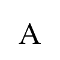

### Фото инвертированной буквы
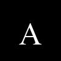

### Профили буквы
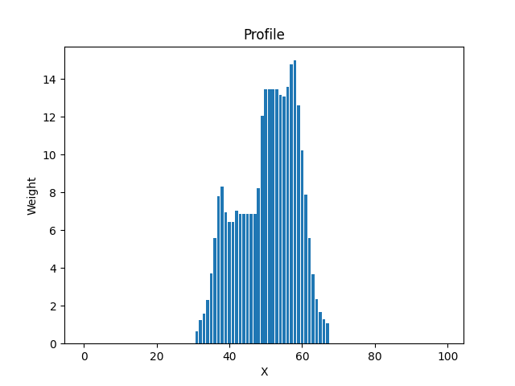
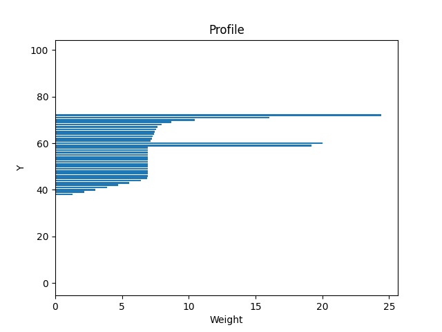

### Признаки:
1. Вес I - 30.529411764705884
2. Относительный вес I - 0.012211764705882354
3. Вес II - 30.992156862745098
4. Относительный вес II - 0.012396862745098039
5. Вес III - 82.0156862745098
6. Относительный вес III - 0.032806274509803925
7. Вес IV - 138.75294117647059
8. Относительный вес IV - 0.055501176470588234
9. Общий вес - 282.29019607843134
10. Относительный общий вес - 0.028229019607843134
11. Центр тяжести Y - 58.56347243831962
12. Центр тяжести X - 50.46242220493443
13. Относительный центр тяжести Y - 0.5856347243831962
14. Относительный центр тяжести X - 0.5046242220493443
15. Момент инерции Y - 18263.67981201705
16. Момент инерции X - 25708.1882134483
17. Относительный момент инерции Y - 0.0001826367981201705
18. Относительный момент инерции X - 0.00025708188213448296

## Символ - Б

### Фото прямой буквы
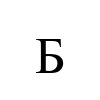

### Фото инвертированной буквы
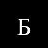

### Профили буквы
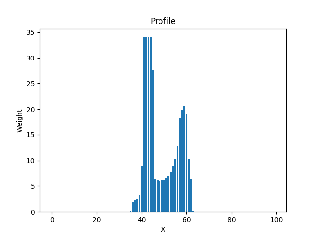
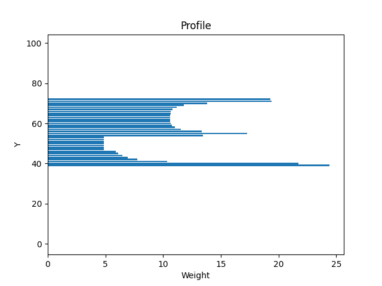

### Признаки:
1. Вес I - 69.45490196078431
2. Относительный вес I - 0.027781960784313726
3. Вес II - 34.78823529411765
4. Относительный вес II - 0.013915294117647059
5. Вес III - 137.74901960784314
6. Относительный вес III - 0.055099607843137256
7. Вес IV - 119.7764705882353
8. Относительный вес IV - 0.04791058823529412
9. Общий вес - 361.7686274509804
10. Относительный общий вес - 0.036176862745098036
11. Центр тяжести Y - 56.59871437707993
12. Центр тяжести X - 48.986233211564105
13. Относительный центр тяжести Y - 0.5659871437707993
14. Относительный центр тяжести X - 0.48986233211564106
15. Момент инерции Y - 19670.28437717132
16. Момент инерции X - 42204.595323627924
17. Относительный момент инерции Y - 0.00019670284377171319
18. Относительный момент инерции X - 0.00042204595323627926

## Символ - В

### Фото прямой буквы
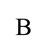

### Фото инвертированной буквы
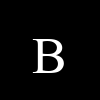

### Профили буквы
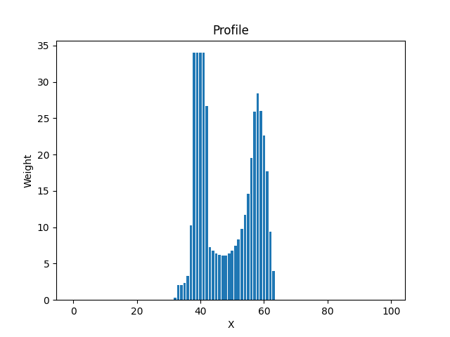
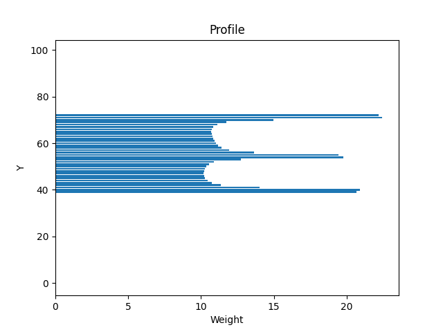

### Признаки:
1. Вес I - 76.69411764705882
2. Относительный вес I - 0.030677647058823528
3. Вес II - 62.6078431372549
4. Относительный вес II - 0.02504313725490196
5. Вес III - 151.42352941176472
6. Относительный вес III - 0.060569411764705886
7. Вес IV - 149.6313725490196
8. Относительный вес IV - 0.05985254901960784
9. Общий вес - 440.35686274509806
10. Относительный общий вес - 0.04403568627450981
11. Центр тяжести Y - 55.69912103374268
12. Центр тяжести X - 48.65059532820974
13. Относительный центр тяжести Y - 0.5569912103374268
14. Относительный центр тяжести X - 0.4865059532820974
15. Момент инерции Y - 34129.961206675725
16. Момент инерции X - 47981.15491469032
17. Относительный момент инерции Y - 0.00034129961206675724
18. Относительный момент инерции X - 0.0004798115491469032

## Символ - Г

### Фото прямой буквы
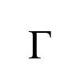

### Фото инвертированной буквы

### Профили буквы
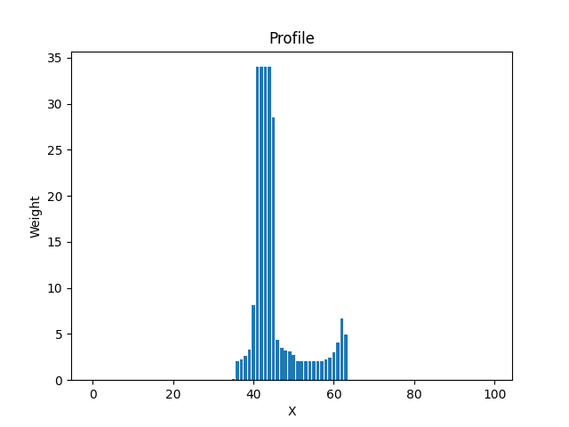
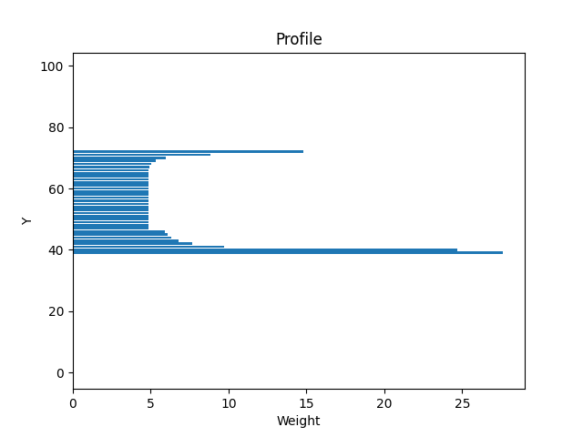

### Признаки:
1. Вес I - 69.94509803921568
2. Относительный вес I - 0.02797803921568627
3. Вес II - 39.48627450980392
4. Относительный вес II - 0.015794509803921566
5. Вес III - 127.06274509803922
6. Относительный вес III - 0.050825098039215685
7. Вес IV - 0.7333333333333333
8. Относительный вес IV - 0.0002933333333333333
9. Общий вес - 237.22745098039215
10. Относительный общий вес - 0.023722745098039216
11. Центр тяжести Y - 52.95391202287868
12. Центр тяжести X - 45.39690542707421
13. Относительный центр тяжести Y - 0.5295391202287868
14. Относительный центр тяжести X - 0.4539690542707421
15. Момент инерции Y - 9234.330590964502
16. Момент инерции X - 31606.62551654818
17. Относительный момент инерции Y - 9.234330590964502e-05
18. Относительный момент инерции X - 0.00031606625516548184

## Символ - Д

### Фото прямой буквы
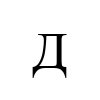

### Фото инвертированной буквы
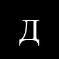

### Профили буквы
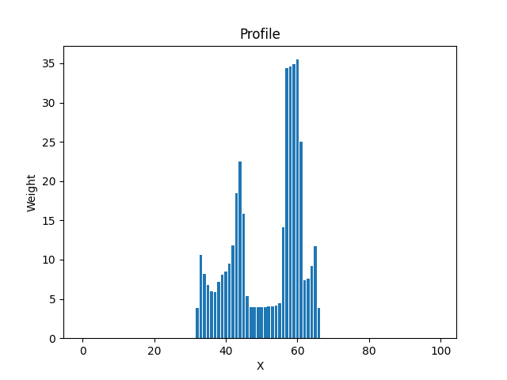
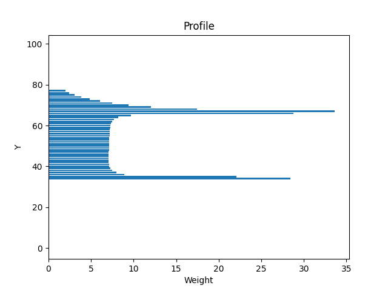

### Признаки:
1. Вес I - 53.819607843137256
2. Относительный вес I - 0.021527843137254903
3. Вес II - 99.17254901960784
4. Относительный вес II - 0.03966901960784314
5. Вес III - 106.67450980392157
6. Относительный вес III - 0.042669803921568626
7. Вес IV - 143.64313725490197
8. Относительный вес IV - 0.05745725490196079
9. Общий вес - 403.3098039215687
10. Относительный общий вес - 0.04033098039215687
11. Центр тяжести Y - 54.46945859748745
12. Центр тяжести X - 51.71183540119016
13. Относительный центр тяжести Y - 0.5446945859748745
14. Относительный центр тяжести X - 0.5171183540119015
15. Момент инерции Y - 37336.940995881065
16. Момент инерции X - 68651.40027237141
17. Относительный момент инерции Y - 0.00037336940995881063
18. Относительный момент инерции X - 0.0006865140027237141

## Вывод по работе
В ходе выполнения лабораторной работы были выделены признаки символов русского алфавита. Для каждого символа были рассчитаны вес, относительный вес, координаты центра тяжести, моменты инерции и их нормированные значения. Также были построены профили X и Y для каждого символа. Полученные данные могут быть использованы для дальнейшего анализа и классификации символов.
