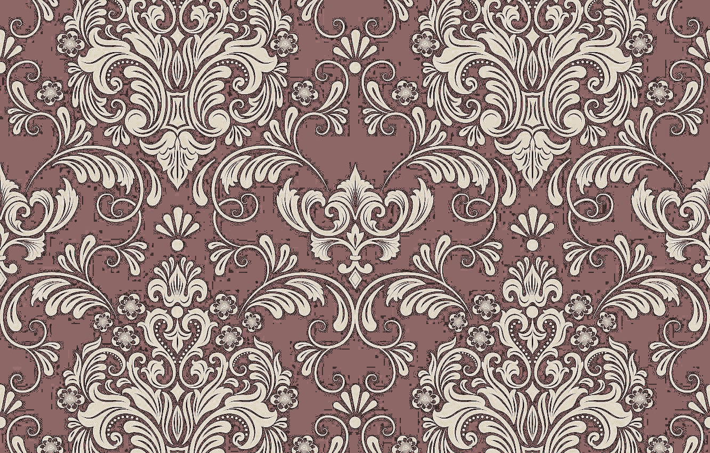

# Лабораторная работа №8. Текстурный анализ и контрастирование

* Матрица: NGLDM, 
* Параметры: d=1 
* Расчет признаков: CNG, CON 
* Метод преобразования яркости: Выравнивание гистограммы

## Изображение 1

### Оригинал

### Полутон (L)

### Полутон после выравнивания

### Цвет после выравнивания

### Гистограмма яркости ДО

### Гистограмма яркости ПОСЛЕ

### Матрица NGLDM (отображение S)

### Текстурные признаки

| **Признак** | **До** | **После** |
|-------------|--------|-----------|
| **CNG**     | 3.8737 | 1.9401    |
| **CON**     | 6.9327 | 58.8235   |

## Изображение 2

### Оригинал

### Полутон (L)

### Полутон после выравнивания

### Цвет после выравнивания

### Гистограмма яркости ДО

### Гистограмма яркости ПОСЛЕ

### Матрица NGLDM (отображение S)

### Текстурные признаки

| **Признак** | **До**  | **После** |
|-------------|---------|-----------|
| **CNG**     | 4.8740  | 2.9283    |
| **CON**     | 79.6455 | 31.2064   |

## Изображение 3

### Оригинал

### Полутон (L)

### Полутон после выравнивания

### Цвет после выравнивания

### Гистограмма яркости ДО

### Гистограмма яркости ПОСЛЕ

### Матрица NGLDM (отображение S)

### Текстурные признаки

| **Признак** | **До**  | **После** |
|-------------|---------|-----------|
| **CNG**     | 5.3416  | 4.3370    |
| **CON**     | 51.9074 | 111.6245  |

## Выводы

Метод NGLDM позволяет количественно оценивать текстуру яркостного канала.

Снижение CNG во всех трёх случаях (в среднем в 1.5–2 раза) указывает на то, что после выравнивания гистограммы уровни яркости распределились более однородно, уменьшилось число соседних пикселей с одинаковым квантованным значением.

Для изображений 1 и 3 контраст (CON) резко возрос. Это объясняется тем, что в исходниках диапазон яркостей был узким, и выравнивание гистограммы значительно «растянуло» значения L, усилив локальные переходы

Таким образом, комбинация NGLDM-признаков и выравнивания гистограммы позволяет количественно оценивать и контролировать изменения текстуры: снижение CNG однозначно связано с «разбросом» яркости по новым уровням, а направление изменения CON зависит от исходного диапазона яркостей изображения.