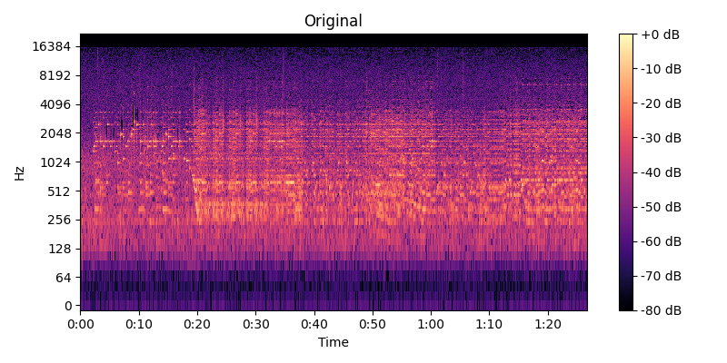
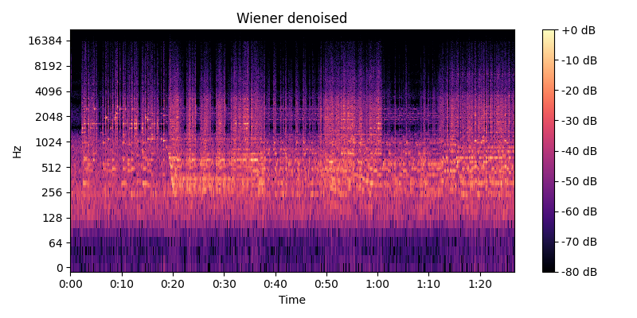
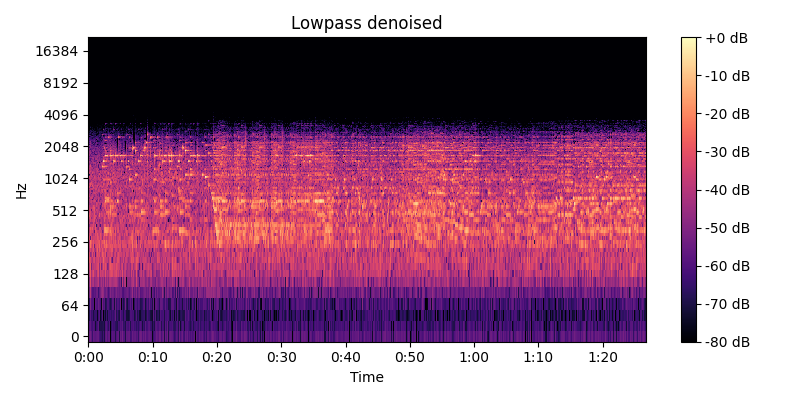

# Лабораторная работа №9. Анализ шума

Работа выполнялась для записи игры на пианино. Запись имела заметный фоновый шум. Построена спектрограмма, проведено устранение шума с помощью фильтра Винера и фильтра нижних частот (lowpass).

## Спектрограмма исходного звука

## Спектрограмма после фильтра Винера

## Спектрограмма после фильтра прохода lowpass

В спектрограммах видно, что после Wiener-фильтра уровень фонового шума снизился, но сохранились резкие переходы сигнала. Low-pass фильтр подчистил высокочастотный шум.

## Выводы

Wiener-фильтр хорошо подавляет стационарный шум, но не удаляет узкополосные «помехи» и может искажать фазу.

Низкочастотный фильтр эффективно отсекает высокочастотный шум, оставляя основной диапазон музыкального инструмента, однако снижает детализацию.